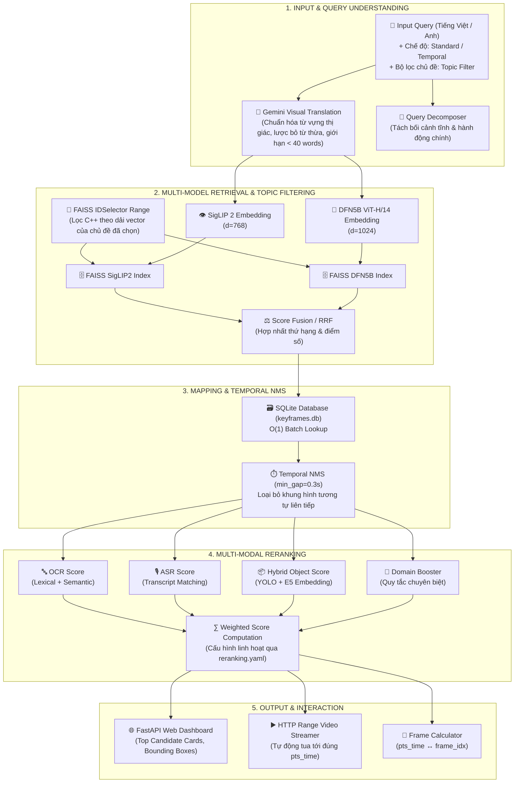

# 🎬 AIC 2026 — Intelligent Video Retrieval & Multi-Score Reranking System

Hệ thống truy xuất và xếp hạng video thông minh đa tầng phục vụ cuộc thi **AI Challenge (AIC) 2026**, kết hợp:
- **Vision-Language Retrieval**: Tích hợp đồng thời **SigLIP 2** và **DFN5B ViT-H/14** (OpenCLIP) với bộ lọc chỉ mục phần vùng chủ đề (**FAISS Topic Range Filtering**).
- **LLM Visual Query Normalization**: Dịch và chuẩn hóa từ vựng thị giác bằng **Google Gemini Flash Lite** với cơ chế chuẩn hóa từ vựng chuyên sâu.
- **Keyframe Mapping & Temporal NMS**: Ánh xạ chỉ mục siêu tốc qua **SQLite** và thuật toán **Temporal Non-Maximum Suppression (NMS)** chống trùng lặp khung hình liên tiếp.
- **Multi-Modal Reranking**: Kết hợp đa nguồn đặc trưng gồm **OCR** (văn bản màn hình), **ASR** (lời thoại/phụ đề âm thanh), **Hybrid Object Matching** (YOLOv8 + E5 Semantic Embedding) và **Domain Booster**.
- **Temporal Sequence Alignment**: Thuật toán tìm kiếm chuỗi sự kiện theo thứ tự thời gian tuyến tính (**Temporal Beam Search**).
- **FastAPI Web Application**: Giao diện người dùng Dark Mode hiện đại, hỗ trợ **HTTP Range Video Streaming** xem video trực tiếp tại timestamp chính xác và công cụ chuyển đổi thời gian sang số khung hình (`frame_idx`).

---

## 🧠 Kiến trúc Pipeline & Dòng chảy dữ liệu (Data Flow)

Toàn bộ hệ thống vận hành theo một luồng xử lý khép kín từ **Input (Truy vấn người dùng)** đến **Output (Khung hình & Phân đoạn video chính xác nhất)**:



---

## 📊 Bảng tổng hợp Input & Output từng tầng

| Tầng (Stage) | Input đầu vào | Thành phần xử lý chính | Output đầu ra |
| :--- | :--- | :--- | :--- |
| **Stage 1: Query Understanding** | Câu truy vấn tự nhiên (Tiếng Việt/Anh), tùy chọn chế độ tìm kiếm. | Gemini Flash Lite (`.api_dich`), Qwen Decomposer. | Câu tiếng Anh chuẩn hóa thị giác, các sub-queries (Context / Action). |
| **Stage 2: Vector Retrieval** | Query text embedding, Topic Filter ID. | FAISS C++ `IDSelectorRange`, SigLIP2, DFN5B ViT-H/14, RRF Fusion. | Danh sách Top K `vector_index` kèm khoảng cách Cosine Similarity. |
| **Stage 3: Keyframe Mapping** | Danh sách `vector_index`. | `keyframes_b1_b2.db` (SQLite Batch Lookup), `temporal_nms`. | Danh sách Candidate đầy đủ thông tin: `video_id`, `frame_idx`, `pts_time`, `ocr`, `asr`, `objects`. |
| **Stage 4: Multi-Score Reranking** | Danh sách Candidate sau NMS, Query tiếng Anh & tiếng Việt. | Multilingual-E5, FAISS IVFPQ Object/Metadata Index, Domain Booster. | Điểm tổng hợp `final_score` và thứ tự xếp hạng chính xác cao nhất. |
| **Stage 5: Output & Presentation** | Top Ranked Candidates. | FastAPI endpoints, HTML5 Jinja2 Templates, Video Range Streaming. | Thẻ kết quả giao diện trực quan, luồng stream video mượt mà, tính toán frame submit. |

---

## 📁 Cấu trúc mã nguồn lõi (Core Codebase)

```
AIC_2026/
├── configs/                          # Cấu hình tham số hệ thống (YAML)
│   ├── retrieval.yaml                # Trọng số mô hình retrieval, top_k, fusion weights
│   ├── reranking.yaml                # Trọng số reranking (OCR, ASR, Object, CLIP)
│   └── reranking_temporal.yaml       # Tham số cho chế độ Temporal Sequence Search
│
├── fastapi_app/                      # Ứng dụng Web & API Backend
│   ├── main.py                       # Khai báo Router, API endpoints & lifecycle
│   ├── services.py                   # Lớp điều phối toàn bộ pipeline tìm kiếm
│   ├── video_stream.py               # Hỗ trợ HTTP Range 206 stream video theo timestamp
│   ├── templates/
│   │   └── index.html                # Giao diện tìm kiếm trực quan, chip lọc chủ đề
│   └── static/
│       ├── css/style.css             # Giao diện Dark theme, responsive & animation
│       └── js/app.js                 # Xử lý tương tác, hotkey, modal video, render kết quả
│
├── src/                              # Mã nguồn thuật toán cốt lõi
│   ├── retrieval/                    # Tầng truy vấn vector đặc trưng
│   │   ├── retrieval_pipeline.py     # Pipeline đơn mô hình SigLIP2, DFN5B, Gemini translator
│   │   ├── retrieval_multi_model.py  # Hợp nhất đa mô hình (SigLIP2 + DFN5B)
│   │   ├── temporal_retrieval_multi_model.py # Truy vấn chuỗi sự kiện thời gian
│   │   ├── topic_filter.py           # Bộ lọc chủ đề video qua FAISS IDSelector C++
│   │   └── temporal_nms.py           # Thuật toán Temporal Non-Maximum Suppression
│   ├── reranking/                    # Tầng tái xếp hạng đa đặc trưng
│   │   ├── reranking_pipeline.py     # Tính điểm OCR, ASR, Hybrid Object (E5), Semantic
│   │   ├── temporal_reranking_pipeline.py # Rerank chuỗi sự kiện temporal
│   │   └── domain_booster.py         # Tăng cường điểm theo quy tắc miền dữ liệu
│   ├── mapping/                      # Tầng ánh xạ dữ liệu
│   │   └── mapping_pipeline.py       # Ánh xạ vector ID sang thông tin keyframe qua SQLite
│   ├── fusion/                       # Hợp nhất điểm số và thứ hạng
│   │   └── retrieval_fusion.py       # Thuật toán RRF (Reciprocal Rank Fusion)
│   └── utils/
│       └── sqlite_keyframe_db.py     # Driver truy vấn SQLite keyframe tốc độ cao
│
├── benchmark/                        # Công cụ đánh giá hiệu năng
│   └── run_benchmark.py              # Đo lường MRR, Recall@K, Rank Variation trên tập câu hỏi chuẩn
│
├── DATA.md                           # 📖 Tài liệu mô tả Schema toàn bộ file Data (.index, .db, .json)
├── run_fastapi.py                    # Entry point khởi chạy web server
└── requirements_docker.txt           # Danh mục thư viện Python yêu cầu
```

> 📌 **Lưu ý về Dữ liệu:** Toàn bộ file index vector, database SQLite và mapping JSON có dung lượng lớn nên không được lưu trữ trong Git. Vui lòng đọc tài liệu [DATA.md](file:///d:/tai_lieu_hoc_tap/AIC_2026/DATA.md) để nắm rõ cấu trúc schema và cách thức tạo/nạp dữ liệu vào hệ thống.

---

## 🚀 Cài đặt & Hướng dẫn sử dụng

### 1. Yêu cầu môi trường
- **Python**: 3.10 – 3.12
- **NVIDIA GPU**: Khuyến nghị có GPU (VRAM >= 8GB) hỗ trợ CUDA 12.x để chạy inference SigLIP2, DFN5B và E5 với tốc độ cao nhất. Hệ thống vẫn hỗ trợ chạy CPU fallback.

### 2. Cài đặt thư viện

```bash
# Clone repository
git clone https://github.com/quachtuankiet06-beep/AIC2026_retrieval_.git
cd AIC2026_retrieval_

# Tạo và kích hoạt môi trường ảo
python -m venv venv
# Windows:
venv\Scripts\activate
# Linux / WSL2:
source venv/bin/activate

# Cài đặt PyTorch tương thích CUDA 12.1 (khuyến nghị):
pip install torch torchvision --index-url https://download.pytorch.org/whl/cu121

# Cài đặt các gói phụ thuộc còn lại:
pip install -r requirements_docker.txt
```

### 3. Cấu hình API Key (Tùy chọn cho tính năng Gemini Visual Translation)
Tạo file `.api_dich` tại thư mục gốc và dán Google Gemini API key:
```
AIzaSy...
```
*(Nếu không có API key, hệ thống sẽ tự động fallback sang câu query gốc hoặc mô hình dịch cục bộ).*

### 4. Chuẩn bị thư mục dữ liệu
Tạo thư mục `data/` và đặt các file theo đúng đặc tả tại [DATA.md](file:///d:/tai_lieu_hoc_tap/AIC_2026/DATA.md):
- `data/indexes/siglip2_keyframes_b1_b2.index`
- `data/indexes/dfn5b_clip_vit_h14_keyframes_b1_b2.index`
- `data/indexes/keyframes_b1_b2.db`
- `data/indexes/object_IVFPQ_b1_b2.index` & `object_mapping_b1_b2_kf.json`
- `data/indexes/metadata_IVFPQ_b1_b2.index` & `metadata_mapping_b1_b2_kf.json`
- `data/mapping/video_fps_mapping.json`

### 5. Khởi chạy Web Server

```bash
python run_fastapi.py
```

Truy cập:
- 🌐 **Giao diện Web**: [http://localhost:8000](http://localhost:8000)
- 📖 **Swagger API Docs**: [http://localhost:8000/docs](http://localhost:8000/docs)

### 6. Chạy Benchmark đánh giá tự động

```bash
python benchmark/run_benchmark.py
```
Benchmark sẽ đo đạc các chỉ số **Recall@1, Recall@5, Recall@10, MRR (Mean Reciprocal Rank)** và so sánh trực tiếp hiệu quả cải thiện thứ hạng giữa Stage 1 (Retrieval) và Stage 2 (Reranking).

---

## 🎯 Tính năng nổi bật trên Web UI

1. **Quick Topic Filter Chips**: Lọc trực tiếp 8 nhóm chủ đề video (Thời sự 60s, Đua xe đạp, Lân sư rồng, Ôn thi THPT, Nấu ăn ViVU, Du lịch miền Tây, Lan tỏa tích cực, Camera giao thông) ngay dưới thanh tìm kiếm. Lọc ở tầng FAISS C++ với 0% nhiễu và 0MB RAM dư thừa.
2. **Video Streaming & Jump to Timestamp**: Bấm vào bất kỳ keyframe nào để mở trình phát video, hệ thống tự động nhảy đến đúng thời điểm xuất hiện của khung hình đó.
3. **Interactive Frame Calculator**: Công cụ dừng video tại thời điểm mong muốn và lấy chính xác số khung hình (`frame_idx`) để nộp bài thi.
4. **Candidate Cards Inspector**: Xem nhanh các nhãn Object phát hiện được, văn bản OCR và lời thoại ASR tại từng khung hình.

---

## 📄 License & Ghi nhận

Dự án được xây dựng phục vụ nghiên cứu và tham gia cuộc thi **AI Challenge (AIC) 2026**.
Mã nguồn phát hành theo giấy phép nội bộ nhóm phát triển.
